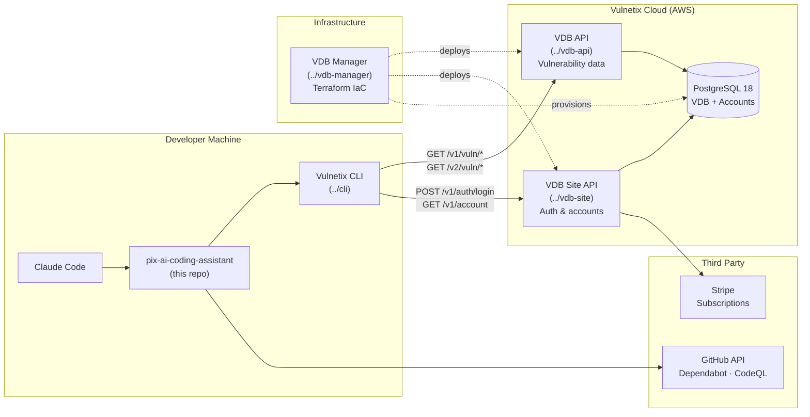
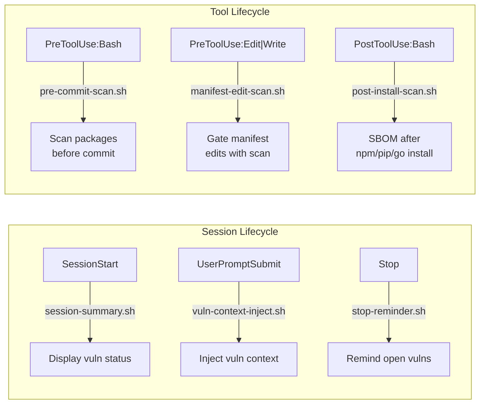
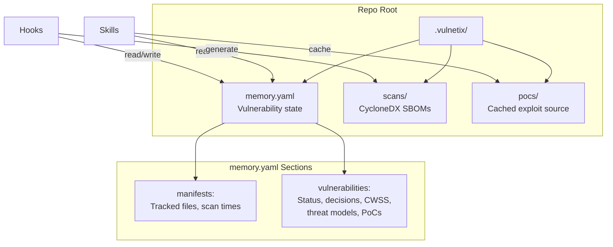

# Vulnetix AI Coding Agent Plugin — Product Requirements

## Purpose

This plugin brings vulnerability intelligence into the AI coding agent development loop. Developers get automatic security scanning on commit/install, on-demand vulnerability analysis, exploit intelligence, and AI-driven remediation — all without leaving their editor.

## System Context

## Repository Dependencies

### Vulnetix CLI (`../cli`)

The plugin's runtime dependency. Every skill and command shells out to CLI subcommands.

| CLI Command | Used By | VDB API Endpoint |
|-------------|---------|------------------|
| `vulnetix vdb vuln <id>` | vuln, exploits, fix, remediation skills | `GET /v1/vuln/{id}` |
| `vulnetix vdb vulns <pkg>` | vuln skill (package mode) | `GET /v1/{package}/vulns` |
| `vulnetix vdb metrics <id>` | vuln, exploits skills | `GET /v1/vuln/{id}` (metrics) |
| `vulnetix vdb exploits <id>` | exploits skill | `GET /v1/exploits/{id}` |
| `vulnetix vdb fixes <id>` | fix skill | `GET /v1/vuln/{id}/fixes` |
| `vulnetix vdb exploits-search` | exploits-search skill, vdb-exploits-search cmd | `GET /v1/exploits` |
| `vulnetix vdb remediation <id>` | remediation skill, vdb-remediation cmd | `GET /v2/vuln/{id}/remediation-plan` |
| `vulnetix auth status` | hooks (auth check) | — |
| `vulnetix env` | context enrichment | — |

The CLI handles authentication (API key via `vulnetix auth login`), request signing, and JSON response parsing.

### VDB API (`../vdb-api`)

The vulnerability data backend. Aggregates 12+ sources (CVE.org, NVD, VulnCheck, CISA KEV, GitHub/OSV, EUVD) into enriched CVE 5.1 responses.

**Key capabilities the plugin relies on:**
- Vulnerability lookup with CVSS v2/v3/v4, EPSS, KEV enrichment
- Exploit records with source attribution (ExploitDB, Metasploit, Nuclei, etc.)
- Fix intelligence with registry versions, distribution patches, source fixes
- V2 remediation plans with workarounds, advisories, CWE guidance, verification steps
- Package vulnerability listings with affected version ranges
- SBOM/manifest scanning endpoints

**API versions:** V1 (original endpoints), V2 (discrete remediation, scanning, cloud locators, malware detection)

**Authentication:** CLI exchanges org credentials at VDB Site API for JWT, then uses API key (`ApiKey {orgId}:{hexDigest}`) for VDB API requests.

### VDB Site (`../vdb-site`)

Account management backend. The plugin depends on it for:

- **Authentication:** `POST /v1/auth/login` — credentials to JWT + API key exchange
- **Account info:** `GET /v1/account` — subscription tier, rate limits
- **Usage tracking:** `GET /v1/usage` — request counts, audit log
- **Registration:** `POST /v1/register` — new account creation (Community tier, free)

**Subscription tiers affecting plugin behavior:**
| Tier | Requests/Day | Cost |
|------|-------------|------|
| Community | 50 | Free |
| Pro | 2,000 | $20/mo |
| Teams | 100,000 | $250/mo |
| Enterprise | Custom | Custom |

Rate limit exhaustion causes CLI commands to fail with 429 errors. The session-summary hook could surface this.

### VDB Manager (`../vdb-manager`)

Terraform IaC that provisions and deploys everything the plugin talks to:

- **ECS Fargate** — runs VDB API and Site API containers
- **PostgreSQL 18 (RDS)** — stores vulnerability data and accounts with read replicas
- **Secrets Manager** — JWT secrets, API keys, Stripe keys shared across services
- **Stripe products** — subscription tier definitions (prices, limits)
- **Lambda functions** — scheduled data processing (source ingestion, EPSS updates)
- **S3** — artifact storage for SBOMs and scan results
- **CI/CD** — GitHub Actions with AWS OIDC for deployment

Changes to rate limits, tiers, or API infrastructure are made here, not in the API repos directly.

## Plugin Feature Matrix

### Skills — LLM-Guided Workflows

| Skill | Reads Memory | Writes Memory | Uses CLI | Uses GitHub | Modifies Code |
|-------|-------------|---------------|----------|-------------|---------------|
| dashboard | Yes | No | No | No | No |
| vuln | Yes | Yes | `vdb vuln`, `vdb vulns`, `vdb metrics` | Dependabot alerts | No |
| exploits | Yes | Yes | `vdb exploits`, `vdb metrics` | — | No |
| exploits-search | Yes | Yes | `vdb exploits-search` | — | No |
| fix | Yes | Yes | `vdb fixes`, `vdb vuln` | Dependabot alerts/PRs | Yes (manifests) |
| remediation | Yes | Yes | `vdb remediation` | Dependabot, CodeQL | Yes (manifests + code) |
| package-search | Yes | Yes | `vdb vulns` | — | No |

### Hooks — Event-Driven Automation

### Commands — Deterministic CLI Wrappers

Commands bypass the LLM (`disable-model-invocation: true`). They run a CLI command, parse JSON, and display structured output. Use these for scripting, quick lookups, or when you want raw data without AI interpretation.

### Agents — Autonomous Multi-Turn

The `bulk-triage` agent runs `/vulnetix:exploits` in parallel across multiple vulnerabilities, then produces a consolidated triage report sorted by CWSS priority. It coordinates memory writes to avoid race conditions.

## Data Architecture

## Development Guidelines

- **Skill implementations** are `SKILL.md` files with YAML frontmatter (`name`, `description`, `user-invocable`, `allowed-tools`, `model`)
- **Command implementations** are markdown files in `commands/` with `disable-model-invocation: true`
- **Hook scripts** are bash, registered in `hooks/hooks.json`, must exit 0 for informational output or non-zero to block
- **Agent definitions** are markdown files in `agents/` with frontmatter (`name`, `description`, `effort`, `maxTurns`, `allowed-tools`, `model`)
- **Website** is Hugo (Go templates) at `website/` — every registered feature must have a corresponding doc page under `website/content/docs/`
- The canonical schema for `.vulnetix/memory.yaml` is defined in `skills/fix/SKILL.md`
- All skills share memory — coordinate writes carefully, especially in the bulk-triage agent
