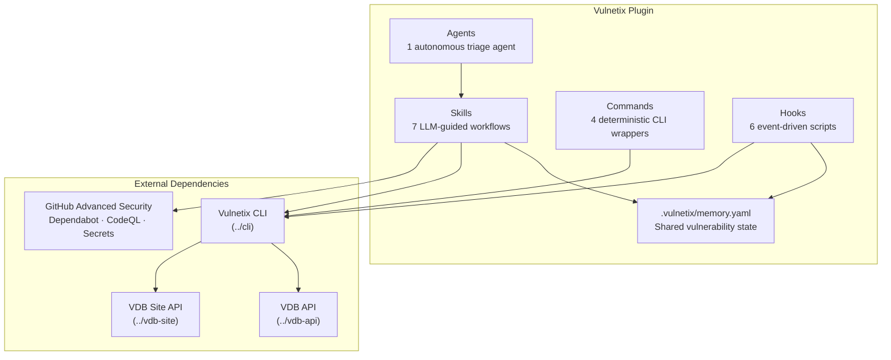
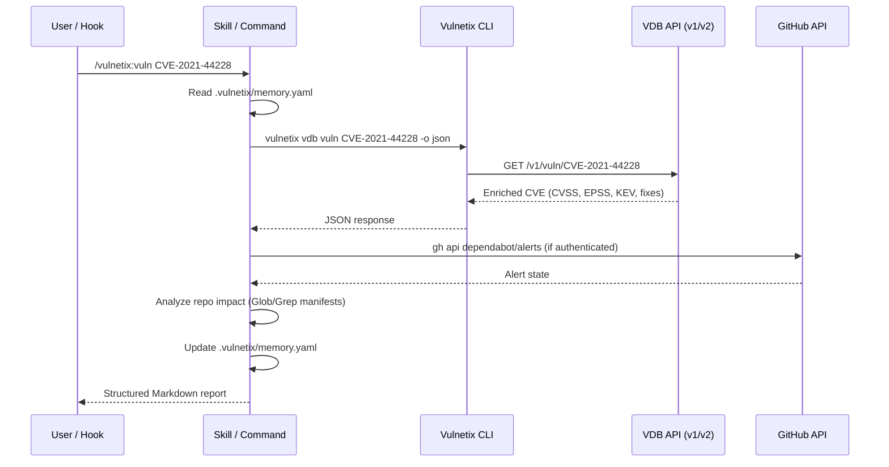

# Vulnetix AI Coding Agent Plugin — System Reference

This is the official Vulnetix plugin for AI coding agents. It extends your coding agent with security skills, hooks, commands, and agents that query the Vulnetix VDB API via the Vulnetix CLI.

## Architecture



## Data Flow



## Plugin Registration

```
vulnetix/
├── .claude-plugin/
│   └── plugin.json              # Plugin metadata (name: "vulnetix", v1.1.0)
├── skills/                      # LLM-guided workflows (SKILL.md per skill)
│   ├── dashboard/SKILL.md       # /vulnetix:dashboard
│   ├── exploits/SKILL.md        # /vulnetix:exploits <vuln-id>
│   ├── exploits-search/SKILL.md # /vulnetix:exploits-search [flags]
│   ├── fix/SKILL.md             # /vulnetix:fix <vuln-id>
│   ├── package-search/SKILL.md  # /vulnetix:package-search <name>
│   ├── remediation/SKILL.md     # /vulnetix:remediation <vuln-id>
│   └── vuln/SKILL.md            # /vulnetix:vuln <id-or-package>
├── commands/                    # Deterministic CLI wrappers (no LLM)
│   ├── vdb-exploits-search.md   # /vulnetix:vdb-exploits-search [flags]
│   ├── vdb-remediation.md       # /vulnetix:vdb-remediation <vuln-id> [flags]
│   ├── vdb-vuln.md              # /vulnetix:vdb-vuln <vuln-id>
│   └── vdb-vulns.md             # /vulnetix:vdb-vulns <package>
├── hooks/
│   ├── hooks.json               # Hook registration — Claude Code (5 event types)
│   ├── hooks.augment.json       # Augment hooks config
│   ├── hooks.codebuddy.json     # CodeBuddy hooks config
│   ├── hooks.codex.json         # OpenAI Codex hooks config
│   ├── hooks.copilot.json       # GitHub Copilot hooks config (camelCase events)
│   ├── hooks.gemini.json        # Gemini CLI hooks config (PascalCase events)
│   ├── hooks.amazonq.json       # Amazon Q Developer hooks config
│   ├── hooks.cortex.json        # Cortex Code hooks config
│   ├── hooks.iflow.json         # iFlow CLI hooks config
│   ├── hooks.kiro.json          # Kiro CLI hooks config (canonical tool matchers)
│   ├── hooks.openhands.json     # OpenHands hooks config (partial)
│   ├── hooks.qoder.json         # Qoder hooks config
│   ├── hooks.qwen.json          # Qwen Code hooks config (timeouts in ms)
│   ├── hooks.cursor.json        # Cursor hooks config (Cursor event names)
│   ├── cline/                   # Cline dispatcher scripts
│   │   ├── PreToolUse           # Routes to pre-commit/manifest-edit by tool name
│   │   └── PostToolUse          # Routes to post-install by tool name
│   ├── pre-commit-scan.sh       # PreToolUse:Bash — scan before git commit
│   ├── manifest-edit-scan.sh    # PreToolUse:Edit|Write — gate manifest edits
│   ├── post-install-scan.sh     # PostToolUse:Bash — SBOM after npm/pip/go install
│   ├── session-summary.sh       # SessionStart — vulnerability status dashboard
│   ├── stop-reminder.sh         # Stop — remind about unresolved vulns
│   └── vuln-context-inject.sh   # UserPromptSubmit — inject vuln context
└── agents/
    └── bulk-triage.md           # Parallel multi-vuln triage agent
```

## Skills (7)

| Skill | Command | Model | Purpose |
|-------|---------|-------|---------|
| dashboard | `/vulnetix:dashboard` | haiku | View all tracked vulnerabilities and status |
| exploits | `/vulnetix:exploits <vuln-id>` | sonnet | Exploit intelligence, ATT&CK mapping, CWSS scoring |
| exploits-search | `/vulnetix:exploits-search [flags]` | sonnet | Discover exploited vulns across ecosystems |
| fix | `/vulnetix:fix <vuln-id>` | sonnet | Fix intelligence, manifest edits, verification |
| package-search | `/vulnetix:package-search <name>` | sonnet | Pre-install security risk assessment |
| remediation | `/vulnetix:remediation <vuln-id>` | sonnet | Context-aware remediation plan with verification |
| vuln | `/vulnetix:vuln <id-or-package>` | sonnet | Vulnerability lookup or package vuln listing |

## Commands (4)

| Command | Invocation | Purpose |
|---------|-----------|---------|
| vdb-vuln | `/vulnetix:vdb-vuln <vuln-id>` | Raw vulnerability data lookup |
| vdb-vulns | `/vulnetix:vdb-vulns <package>` | Raw package vulnerability listing |
| vdb-exploits-search | `/vulnetix:vdb-exploits-search [flags]` | Raw exploit search results |
| vdb-remediation | `/vulnetix:vdb-remediation <vuln-id> [flags]` | Raw remediation plan from V2 API |

Commands have `disable-model-invocation: true` — they execute CLI commands and display output without LLM interpretation.

## Hooks (6)

| Hook | Event | Matcher | Script | Timeout |
|------|-------|---------|--------|---------|
| Pre-Commit Scan | PreToolUse | Bash | `pre-commit-scan.sh` | 30s |
| Manifest Edit Gate | PreToolUse | Edit\|Write | `manifest-edit-scan.sh` | 30s |
| Post-Install Scan | PostToolUse | Bash | `post-install-scan.sh` | 120s |
| Session Summary | SessionStart | — | `session-summary.sh` | 10s |
| Stop Reminder | Stop | — | `stop-reminder.sh` | 10s |
| Context Inject | UserPromptSubmit | — | `vuln-context-inject.sh` | 15s |

## Agents (1)

| Agent | Model | Max Turns | Purpose |
|-------|-------|-----------|---------|
| bulk-triage | sonnet | 15 | Parallel multi-vulnerability triage with CWSS prioritization |

## Shared State: .vulnetix/memory.yaml

All skills read and write `.vulnetix/memory.yaml` in the repo root. The canonical schema is defined in the fix skill (`skills/fix/SKILL.md`). Key sections:

- **`manifests:`** — tracked manifest files, scan timestamps, SBOM paths
- **`vulnerabilities:`** — per-vuln entries with status, decision, severity, threat_model, cwss, pocs, dependabot, history

VEX status values: `affected`, `under_investigation`, `fixed`, `not_affected`
Decision choices: `investigating`, `fix-applied`, `risk-accepted`, `deferred`, `not-applicable`

## Supported Ecosystems

npm, go, cargo, pypi, rubygems, maven, packagist, nuget

## CLI Commands Used

The plugin invokes these Vulnetix CLI commands:

```bash
vulnetix vdb vuln <id> -o json           # Vulnerability lookup
vulnetix vdb vulns <package> -o json     # Package vulnerabilities
vulnetix vdb metrics <id> -o json        # CVSS/EPSS metrics
vulnetix vdb exploits <id> -o json       # Exploit records
vulnetix vdb fixes <id> -o json          # Fix intelligence
vulnetix vdb exploits-search [flags]     # Exploit discovery
vulnetix vdb remediation <id> [flags]    # V2 remediation plan
vulnetix env                             # Environment context
vulnetix auth status                     # Auth check
```

## GitHub Integration

When `gh` CLI is authenticated, skills query:
- Dependabot alerts (`gh api repos/{owner}/{repo}/dependabot/alerts`)
- CodeQL analyses (`gh api repos/{owner}/{repo}/code-scanning/alerts`)
- Secret scanning (`gh api repos/{owner}/{repo}/secret-scanning/alerts`)

## Not Worth Pursuing

Evaluated and ruled out — no hooks, skills, or plugin extensibility relevant to this plugin:

- **Auto-GPT Forge** — framework, not a coding agent
- **Blackbox AI** — no hooks/skills documentation
- **bolt.new** — web builder, no extensibility API
- **Lovable** — web builder, not a coding agent
- **Mentat** — minimal extensibility, no hooks/skills
- **NVIDIA OpenShell** — sandbox runtime, not a coding agent
- **PearAI** — inherits Cline hooks, not standalone
- **Replit Agent** — cloud IDE, no extensibility API
- **Supermaven** — autocomplete only, no agent mode
- **v0** — web builder, no extensibility API
- **Warp** — terminal AI, MCP only, no hooks/skills
